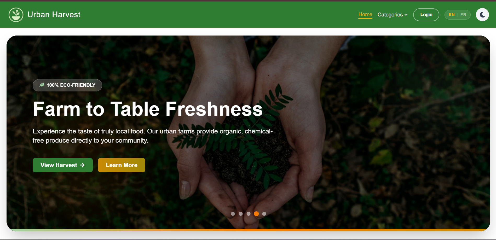
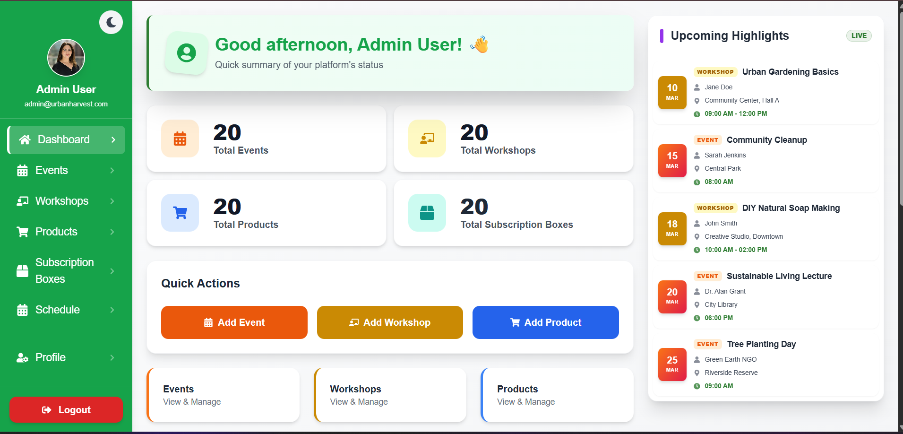
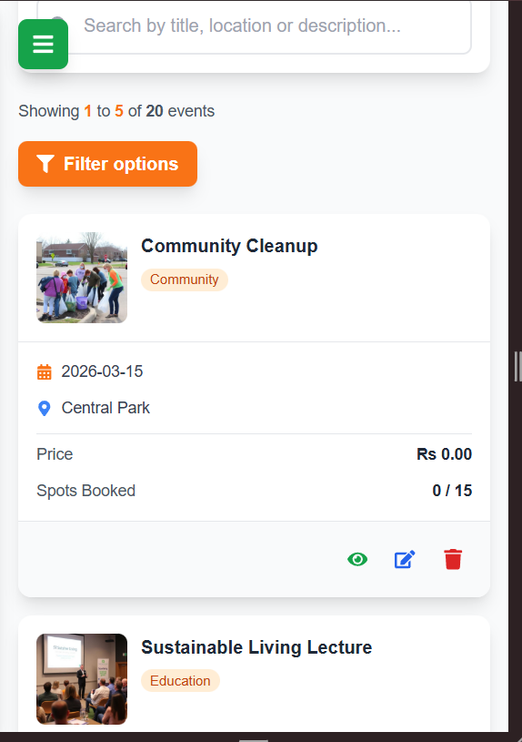

# 🌿 Urban Harvest Hub - Full-Stack PWA

Urban Harvest Hub is an industrial-grade, full-stack Progressive Web Application (PWA) designed to foster sustainable living. Developed as a comprehensive solution for community-driven sustainable agriculture, it features real-time inventory management, automated review systems, and offline-first capabilities.

---

## 📸 Project Gallery

<div align="center">
  
  <p><em>Professional Full-Stack PWA Solution</em></p>
</div>

| Dashboard Preview | Admin Management | Mobile Responsive View |
| :---: | :---: | :---: |
|  |  |  |

---

## 🏗️ System Architecture

The application follows a modern **MVC (Model-View-Controller)** pattern with a decoupled frontend and backend:

*   **Frontend:** React 19 SPA (Single Page Application) powered by Vite. Uses Context API for global state management (Auth, Cart, Notifications).
*   **Backend:** Node.js & Express RESTful API. Handles business logic, authentication, and data validation.
*   **Database:** Relational MySQL database for transaction integrity and complex relationships (Users ↔ Bookings ↔ Events).
*   **Storage:** Cloudinary API for high-performance image delivery and transformation.

---

## 🛠️ Technology Stack

| Layer | Technologies |
| :--- | :--- |
| **Frontend** | React, Recharts (Analytics), Tailwind CSS, Framer Motion (Animations) |
| **PWA** | Workbox, Vite-PWA, Service Workers, Web App Manifest |
| **Backend** | Node.js, Express, JWT (Auth), Bcrypt (Security), Multer |
| **Database** | MySQL (XAMPP/Railway), SQL Triggers for Rating Calculations |
| **Services** | Cloudinary (Images), Axios (API Communication) |

---

## � Installation & Setup

### 1. Database Implementation
1. Ensure **MySQL/XAMPP** is running.
2. Import `/server/database/mysql_schema.sql` to create tables and triggers.
3. The database uses **Triggers** to automatically calculate the `average_rating` and `reviews_count` whenever a new review is added—making the system highly efficient.

### 2. Environment Configuration
Create a `.env` file in the `server` folder:
```env
PORT=5000
DB_HOST=localhost
DB_USER=root
DB_PASSWORD=''
DB_NAME=urban_harvest
JWT_SECRET=your_secret_key
CLOUDINARY_CLOUD_NAME=your_name
CLOUDINARY_API_KEY=your_key
CLOUDINARY_API_SECRET=your_secret
```

### 3. Execution
```bash
# Start Backend
cd server && npm install && npm start

# Start Frontend
cd client && npm install && npm run dev
```

---

## 📡 API Reference (Partial)

### Authentication
| Method | Endpoint | Description | Access |
| :--- | :--- | :--- | :--- |
| `POST` | `/api/auth/signup` | Register a new customer | Public |
| `POST` | `/api/auth/login` | Authenticate and return JWT | Public |

### Workshops & Events
| Method | Endpoint | Description | Access |
| :--- | :--- | :--- | :--- |
| `GET` | `/api/workshops` | Fetch all active workshops | Public |
| `POST` | `/api/workshops` | Create a new workshop | Admin |
| `GET` | `/api/events/:id` | Get detail + reviews | Public |

---

## 🧪 Comprehensive Testing Suite

### 1. PWA Performance (Lighthouse)
*   **Metric Goal:** Score ≥ 90.
*   **How to Test:** Use Chrome DevTools (F12) > Lighthouse > Category: PWA > Mobile.
*   **Expected Result:** "Manifest is valid", "Service Worker registered", and "Provides a 512x512 icon".

### 2. Offline Resilience
*   **Scenario:** User loses connection while browsing.
*   **How to Test:** Toggle "Offline" in Network tab.
*   **Result:** The "App Shell" remains visible, and the user sees a professional `offline.html` page instead of a browser error.

### 3. Security (JWT Protection)
*   **Scenario:** Unauthorized user tries to access `/admin/dashboard`.
*   **Result:** The `requireAdmin` middleware detects a missing/invalid token and redirects the user to `/login`.

### 4. Data Consistency
*   **Scenario:** Add a 5-star review to a product.
*   **Result:** The database trigger executes instantly; the product's `average_rating` updates to the correct decimal (e.g., from 4.0 to 4.2) across all components.

---

## 🔒 Security & Optimization
*   **Passwords:** Hashed using `bcrypt` (10 rounds).
*   **Caching:** Implements `Stale-While-Revalidate` for images and `Network-First` for API data to ensure users never see stale prices.
*   **Responsive:** Grid-based layout handles everything from a 280px Fold phone to a 4K monitor.

---

## 👨‍💻 Project Information
*   **Module:** Advanced Web Development (PWA Specialization)
*   **Author:** [Your Name]
*   **Version:** 1.2.0 (Stable Production Build)
